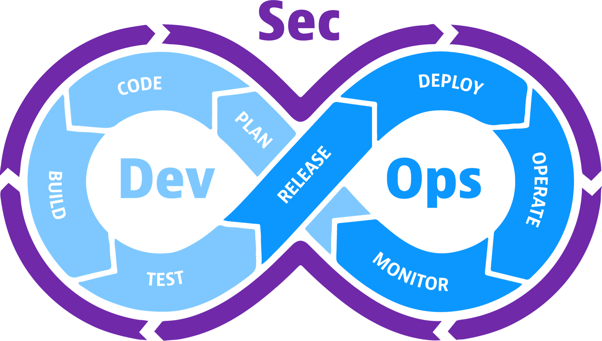

<!-- Improved compatibility of back to top link: See: https://github.com/othneildrew/Best-README-Template/pull/73 -->
<a name="readme-top"></a>
<!--
*** Thanks for checking out the Best-README-Template. If you have a suggestion
*** that would make this better, please fork the repo and create a pull request
*** or simply open an issue with the tag "enhancement".
*** Don't forget to give the project a star!
*** Thanks again! Now go create something AMAZING! :D
-->


<!-- PROJECT SHIELDS -->
<!--
*** I'm using markdown "reference style" links for readability.
*** Reference links are enclosed in brackets [ ] instead of parentheses ( ).
*** See the bottom of this document for the declaration of the reference variables
*** for contributors-url, forks-url, etc. This is an optional, concise syntax you may use.
*** https://www.markdownguide.org/basic-syntax/#reference-style-links
-->

<!-- PROJECT LOGO -->
<br />

<div align="center">
  <a href="https://github.com/danunziata/pps_fede_Ferro_2024">
    
  </a>
<h3 align="center">PPS Federico Rodriguez Ferro</h3>

  <p align="center">
    Seguridad de entornos contenerizados con enfoque en Kubernetes
    <br />
    <a href="https://danunziata.github.io/pps_fede_Ferro_2024/"><strong>Mira la Documentación completa »</strong></a>
    <br />
    <br />
  </p>

</div>


<!-- TABLE OF CONTENTS -->

<details>
  <summary>Tabla de Contenidos</summary>
  <ol>
    <li>
      <a href="#sobre-el-proyecto">Sobre el proyecto</a>
      <ul>
        <li><a href="#Componentes">Componentes</a></li>
      </ul>
    </li>
    <li>
      <a href="#para-comenzar">Para Comenzar</a>
      <ul>
        <li><a href="#prerequisitos">Prerequisitos</a></li>
        <li><a href="#instalación">Instalación</a></li>
      </ul>
    </li>
    <li><a href="#uso">Uso</a></li>
    <li><a href="#roadmap">Roadmap</a></li>
    <li><a href="#contribuir">Contribuir</a></li>
    <li><a href="#licencia">Licencia</a></li>
    <li><a href="#contacto">Contacto</a></li>
  </ol>
</details>

<!-- ABOUT THE PROJECT -->

## Sobre el proyecto



El proyecto "Seguridad en Kubernetes" se enfoca en fortalecer la  seguridad y privacidad del entorno productivo del clúster de Kubernetes, mediante la implementación de medidas efectivas que mitiguen posibles  riesgos de seguridad. Los objetivos generales incluyen mejorar la  infraestructura y salvaguardar la integridad de los sistemas y la  confidencialidad de los datos. 

Para lograr esto, se plantean objetivos  específicos como familiarizarse con la tecnología de contenedores,  desplegar un clúster de Kubernetes correctamente configurado, aplicar  medidas de seguridad necesarias y evaluar soluciones de monitoreo y  detección de intrusiones. El proyecto también incluye pruebas de  penetración, evaluación de vulnerabilidades y documentación detallada de las configuraciones y medidas de seguridad implementadas.

<p align="right">(<a href="#readme-top">Volver al Inicio</a>)</p>

### Componentes

* [](https://kubernetes.io)
* [](https://www.python.org/)
* [](https://helm.sh/)

<p align="right">(<a href="#readme-top">Volver al Inicio</a>)</p>

<!-- GETTING STARTED -->

## Para Comenzar

Este repositorio tiene como objetivo proporcionarte la información necesaria para comenzar rápidamente a trabajar con el proyecto en cuestión. Ya seas un desarrollador experimentado o nuevo en el proyecto, esta guía te ayudará a empezar en poco tiempo.

### Prerequisitos

Acá se listan todo lo que se debe descargar para luego poder instalar y hacer funcionar el proyecto
* Python
  
  ```sh
  sudo apt update
  sudo apt install python
  ```

- Instalar las librerias necesarias

  ```sh
  python3 -m venv venv #Crea un nuevo entorno virtual donde se guardan todas las librerias a utilizar
  source venv/bin/activate
  pip install -r requirements.txt
  ```


- Helm

  ```sh
  curl -fsSL -o get_helm.sh https://raw.githubusercontent.com/helm/helm/main/scripts/get-helm-3
  sudo chmod 700 get_helm.sh
  ./get_helm.sh
  ```

  

### Instalación


<p align="right">(<a href="#readme-top">Volver al Inicio</a>)</p>

<!-- USAGE EXAMPLES -->

## Uso

Para ejemplos e información, por favor diríjase a la [Documentación](https://danunziata.github.io/pps_fede_Ferro_2024/)

<p align="right">(<a href="#readme-top">Volver al Inicio</a>)</p>

<!-- ROADMAP -->

## Roadmap

- [ ] Investigar la literatura existente sobre seguridad en entornos clusterizados utilizando contenedores y Kubernetes.
- [ ] Desplegar un entorno de laboratorio local que permita realizar pruebas y experimentos.
- [ ] Seleccionar, evaluar e implementar soluciones de seguridad específicas para Kubernetes, como Kubernetes Security Context, Network Policies, soluciones de monitoreo y observabilidad, entre otros.
- [ ] Desplegar un entorno de laboratorio remoto (producción) *y*  aplicar las medidas de seguridad seleccionadas al clúster de Kubernetes en producción , siguiendo las mejores prácticas recomendadas.
- [ ] Realizar pruebas y evaluación de vulnerabilidades utilizando herramientas y metodologías seleccionadas en entorno de laboratorio productivo.
- [ ] Documentar el proceso, las configuraciones, medidas de seguridad implementadas y los resultados de las pruebas realizadas.

<p align="right">(<a href="#readme-top">Volver al Inicio</a>)</p>

<!-- CONTRIBUTING -->
## Contribuir

### Flujo de Trabajo

El proceso que seguiremos implica utilizar la rama `main` como la rama de **producción** del proyecto. Cualquier nueva funcionalidad o corrección de errores se realizará creando nuevas ramas.

Para incorporar una función en la rama `main`,  simplemente se crea un "PR" (Pull Request), que deberá ser aprobado por algún colaborador, cualquier colaborador puede hacerlo, o bien, si no  requiere revisión, puede ser aceptado por quien esté incluyendo la  funcionalidad.

Es crucial que el nombre de las ramas creadas sea lo más descriptivo  posible. Por ejemplo, si trabajamos en una nueva funcionalidad  relacionada con la API, la rama se debe llamar como referencia a la funcionalidad en cuestión. En el caso de tratarse de la corrección de un error en el código de la API, la llamaremos `fix-api`.

Además, se contarán con ramas específicas para la documentación del proyecto denominada `docs`, esta rama sera utilizada para registrar toda la documentación ya sea de la carpeta `docs` o el mismo `README.md`.

Los pasos para contribuir en este proyecto como miembro del mismo son:

1. Clonar el repositorio (`git clone`)
2. Crear una nueva rama para la función (`git checkout -b feature/AmazingFeature`)
3. Publicar la rama en el repositorio remoto(`git push --set-upstream origin <nombre-de-la-nueva-rama>`)
4. Commit los cambios (`git commit -m 'Add some AmazingFeature'`)
5. Push a la rama (`git push origin feature/AmazingFeature`)
6. Abrir un Pull Request dirigido a la rama `develop`

### Commits

Los commits convencionales nos permiten mantener la organización al realizar los commits y facilitan la creación de `releases` de forma automatizada.

Se basan en el uso de palabras clave al inicio del mensaje de cada commit, de la siguiente manera:

- **feat(tema de la modificación): Breve explicación**: Para cambios significativos o nuevas características.
- **fix(tema de la modificación): Breve explicación**: Para correcciones pequeñas.
- **chore(tema de la modificación): Breve explicación**: Para cambios menores insignificantes para el usuario.
- **docs: Breve explicación**: Para cambios que se realizan a la documentación.

<p align="right">(<a href="#readme-top">Volver al Inicio</a>)</p>

<!-- LICENSE -->

## Licencia

Este proyecto se distribuye bajo los términos de la  Licencia Pública General de GNU, versión 3.0 (GNU General Public  License, version 3.0). Consulta el archivo [LICENSE](https://github.com/danunziata/pps_fede_Ferro_2024/blob/main/LICENSE) para obtener detalles completos.

### Resumen de la Licencia

La Licencia Pública General de GNU, versión 3.0 (GNU GPL-3.0), es una licencia de código abierto que garantiza la libertad de uso, modificación y distribución del software bajo los términos estipulados en la licencia. Requiere que cualquier software derivado se distribuya bajo los mismos términos de la GPL-3.0. Consulta el archivo [LICENSE](https://github.com/danunziata/pps_fede_Ferro_2024/blob/main/LICENSE) para más información sobre los términos y condiciones.

### Aviso de Copyright

El aviso de copyright para este proyecto se encuentra detallado en el archivo [LICENSE](https://github.com/danunziata/pps_fede_Ferro_2024/blob/main/LICENSE).

<p align="right">(<a href="#readme-top">Volver al Inicio</a>)</p>

<!-- CONTACT -->

## Contacto

Federico Rodriguez Ferro - federico@rodriguezferro.com.ar

Link del Proyecto: [https://github.com/danunziata/pps_fede_Ferro_2024](https://github.com/danunziata/pps_fede_Ferro_2024)

<p align="right">(<a href="#readme-top">Volver al Inicio</a>)</p>
