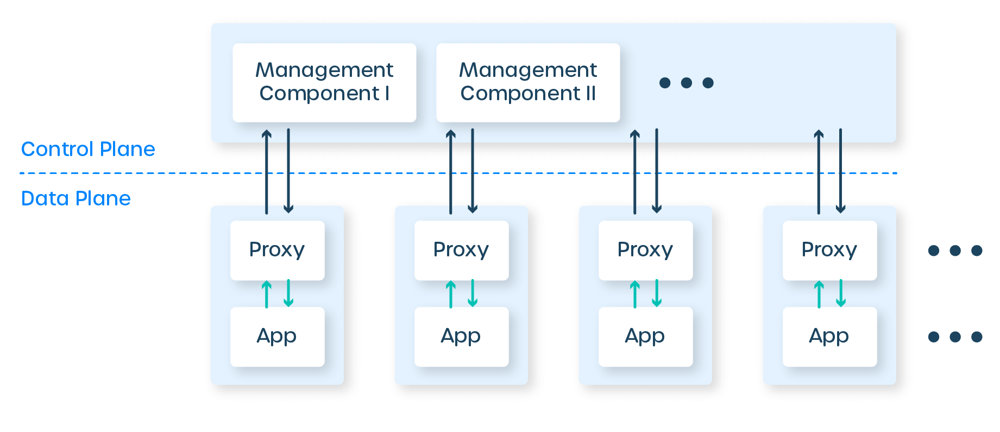

# Service Mesh

Es un conjunto de proxies en el espacio de usuario, colocados junto a tus servicios, más un conjunto de procesos de gestión. Los proxies se denominan plano de datos del service mesh, y los procesos de gestión, su plano de control. El plano de datos intercepta las llamadas entre servicios y “hace cosas” con estas llamadas; el plano de control coordina el comportamiento de los proxies y proporciona una API para ti, el operador, para manipular y medir la malla en su totalidad.

Estos Proxys hacen llamadas hacia y desde los servicios e implementan un conjunto de características que se centran en las llamadas entre servicios. Este enfoque en el tráfico entre servicios es lo que diferencia a los proxies del service mesh de, por ejemplo, las puertas de enlace API o los proxies de ingreso, que se centran en las llamadas del mundo exterior hacia el clúster en su totalidad. Eso es el plano de datos.

El plano de control es más simple: es un conjunto de componentes que proporcionan cualquier maquinaria que el plano de datos necesite para actuar de manera coordinada, incluyendo descubrimiento de servicios, emisión de certificados TLS, agregación de métricas, etc. El plano de datos llama al plano de control para informar su comportamiento; el plano de control, a su vez, proporciona una API para permitir al usuario modificar e inspeccionar el comportamiento del plano de datos en su conjunto.



La arquitectura del service mesh tiene un par de grandes implicaciones. Por un lado, dado que el conjunto de características del proxy está diseñado para llamadas de servicio a servicio, el service mesh realmente solo tiene sentido si tu aplicación está construida como servicios. Podrías usarlo con un monolito, pero sería un montón de maquinaria para ejecutar un solo proxy, y el conjunto de características no se ajustaría bien.

## Ejemplo

Una implementacion de ejemplo es la que ofrece Google Cloud Platform que se llama Online Boutique.

Online Boutique es una aplicación de demostración de microservicios orientada a la nube. La aplicación es una tienda de comercio electrónico basada en la web donde los usuarios pueden buscar artículos, agregarlos al carrito y comprarlos.

Google utiliza esta aplicación para demostrar cómo los desarrolladores pueden modernizar aplicaciones empresariales utilizando productos de Google Cloud, incluidos: Google Kubernetes Engine (GKE), Anthos Service Mesh (ASM), gRPC, Cloud Operations, Spanner, Memorystore, AlloyDB y Gemini. Esta aplicación funciona en cualquier clúster de Kubernetes.

Utilizaremos esta implementacion para probar las distintas aplicaciones de service mesh.

Para mas información, dirigirse al [Repositorio de GitHub de Online Boutique](https://github.com/GoogleCloudPlatform/microservices-demo/)

## Implicaciones en la Seguridad de Nuestro Servicios

Una aplicación monolítica ejecuta todas las llamadas de función a función dentro del monolito y es segura. Sin embargo, una aplicación de microservicios utiliza HTTP para comunicarse con otros servicios y, en general, tiene una mayor necesidad de autenticación y autorización para asegurar la comunicación entre estos servicios distribuidos. Además, si no es segura, un hacker puede interceptar la solicitud y acceder a datos sensibles. Es por eso que los microservicios tienen una mayor necesidad de seguridad. Con un Service Mesh, el proxy Sidecar desplegado con cada microservicio ayuda a satisfacer las necesidades de autenticación y autorización para controlar el flujo de tráfico.

Además, permite que las solicitudes sean autorizadas bajo el principio de privilegio mínimo utilizando un Control de Acceso Basado en Roles/Atributos (RBAC/ABAC). Estas medidas de seguridad se aplican en el Sidecar y en el Service Mesh y, como resultado, la solicitud se valida en el proxy Sidecar y solo se reenvía al microservicio si está autorizada para acceder a él, garantizando así una alta seguridad.

La Seguridad de Confianza Cero (Zero Trust Security) es un marco de seguridad que sugiere que cualquier cosa dentro de un perímetro de seguridad no es confiable y puede comprometer la red. Por lo tanto, requiere que el recurso sea autenticado, autorizado y validado continuamente contra una configuración de seguridad definida antes de obtener acceso a los datos requeridos.

## Linkerd

Linkerd es una malla de servicios para Kubernetes. Facilita y protege la ejecución de servicios al proporcionar depuración en tiempo de ejecución, capacidad de observación, confiabilidad y seguridad, todo sin requerir cambios en tu código.

Linkerd funciona instalando un conjunto de "micro-proxies" ultraligeros y transparentes junto a cada instancia de servicio. Estos proxies manejan automáticamente todo el tráfico hacia y desde el servicio. Al ser transparentes, estos proxies actúan como pilas de red altamente instrumentadas fuera del proceso, enviando telemetría y recibiendo señales de control desde el plano de control. Este diseño permite que Linkerd mida y manipule el tráfico hacia y desde tu servicio sin introducir una latencia excesiva.

Para ser lo más pequeños, ligeros y seguros posible, los micro-proxies de Linkerd están escritos en Rust y son especializados para Linkerd. Puedes obtener más información sobre estos micro-proxies en nuestra publicación de blog, "Bajo el capó del proxy de Rust de última generación de Linkerd, Linkerd2-proxy".

### Instalación

Empezamos instalando el CLI

```sh
curl --proto '=https' --tlsv1.2 -sSfL https://run.linkerd.io/install-edge | sh
```

Nos aseguramos de añadir el binario al path

```sh
export PATH=$HOME/.linkerd2/bin:$PATH
```

Verificamos que linkerd este corriendo de manera correcta

```sh
linkerd version
```

Validamos el cluster

```sh
linkerd check --pre
```

Ahora procedemos a instalar linkerd en nuestro cluster

```
linkerd install --crds | kubectl apply -f -
linkerd install | kubectl apply -f -
```

Instalamos el dashboard tambien

```sh
linkerd viz install | kubectl apply -f -
```

Esperamos un par de minutos y comprobamos la instalación

```sh
linkerd check
```

### Implementación

Hacemos uso de nuestro ejemplo inyectandole el proxy a cada uno de los microservicios

```sh
cat config.yaml | linkerd inject - | kubectl apply -f -
```

Accedemos al dashboard con

```sh
linkerd viz dashboard &
```

¡Entendido! Aquí tienes la sección completada según tu solicitud:

### Instalación

Empezamos instalando el CLI

```sh
curl --proto '=https' --tlsv1.2 -sSfL https://run.linkerd.io/install-edge | sh
```

Nos aseguramos de añadir el binario al path

```sh
export PATH=$HOME/.linkerd2/bin:$PATH
```

Verificamos que Linkerd esté corriendo de manera correcta

```sh
linkerd version
```

Validamos el cluster

```sh
linkerd check --pre
```

Ahora procedemos a instalar Linkerd en nuestro cluster

```sh
linkerd install --crds | kubectl apply -f -
linkerd install | kubectl apply -f -
```

Instalamos el dashboard también

```sh
linkerd viz install | kubectl apply -f -
```

Esperamos un par de minutos y comprobamos la instalación

```sh
linkerd check
```

### Implementación

Hacemos uso de nuestro ejemplo inyectándole el proxy a cada uno de los microservicios

```sh
cat config.yaml | linkerd inject - | kubectl apply -f -
```

Accedemos al dashboard con

```sh
linkerd viz dashboard &
```

Una vez que hayas accedido al dashboard, podrás visualizar las métricas y el estado de los microservicios inyectados con Linkerd. El dashboard proporciona una vista detallada de la latencia, el tráfico, los errores, y más, ayudándote a monitorear y asegurar el correcto funcionamiento de tus aplicaciones desplegadas en el cluster Kubernetes.

Si encuentras algún problema durante la instalación o implementación, puedes consultar la [documentación oficial de Linkerd](https://linkerd.io/2.11/getting-started/) o buscar ayuda en los foros de la comunidad.

## Consul

HashiCorp Consul es una solución de redes de servicios que permite a los equipos gestionar la conectividad de red segura entre servicios y a través de entornos locales y multi-cloud. Consul ofrece descubrimiento de servicios, malla de servicios, gestión de tráfico y actualizaciones automáticas para dispositivos de infraestructura de red. Puedes utilizar estas funciones de manera individual o conjunta en una única implementación de Consul.

Consul proporciona un plano de control que te permite registrar, consultar y asegurar los servicios desplegados a lo largo de tu red. El plano de control es la parte de la infraestructura de red que mantiene un registro central para rastrear los servicios y sus respectivas direcciones IP. Es un sistema distribuido que se ejecuta en clústeres de nodos, como servidores físicos, instancias en la nube, máquinas virtuales o contenedores.

Consul interactúa con el plano de datos a través de proxies. El plano de datos es la parte de la infraestructura de red que procesa las solicitudes de datos. 

### Instalación

Creamos un archivo `values.yaml` que nos servira para configurar la instalacion via Helm

```yaml
connectInject:
  enabled: true
  default: true
  k8sAllowNamespaces: ['default'] 
  k8sDenyNamespaces: ['kube-system']
```

Con estas configuraciones, instalamos consul

```sh
helm upgrade consul hashicorp/consul --create-namespace --namespace consul --values values.yaml
```

Ingresamos al dashboard con un port-forwarding

```sh
kubectl port-forward service/consul-consul-server --namespace consul 8500:8500
```

## Selección

Despues del analisis realizado, decidimos elegir Linkerd por encima de consul debido a:

- Linkerd se destaca por su simplicidad y facilidad de uso. Está diseñado para ser fácil de instalar, configurar y operar, lo cual es ideal para equipos que buscan una solución de malla de servicios que funcione de manera eficiente sin requerir una gran cantidad de tiempo y esfuerzo en la administración.
- Linkerd está optimizado para funcionar con Kubernetes, proporcionando una integración fluida y nativa que simplifica enormemente la implementación y operación en entornos de Kubernetes.
- Linkerd es conocido por su eficiencia en el uso de recursos, lo cual es crucial para operaciones en producción donde el rendimiento y la escalabilidad son importantes.
- Linkerd ofrece características de seguridad robustas, como el cifrado mutuo TLS entre servicios por defecto, lo que mejora la seguridad sin configuraciones adicionales complicadas.

En resumen, si la prioridad es tener una service mesh que sea fácil de implementar y manejar, Linkerd es una excelente elección. Su simplicidad, eficiencia y fuerte integración con Kubernetes lo convierten en una opción atractiva para muchos equipos de desarrollo y operaciones.