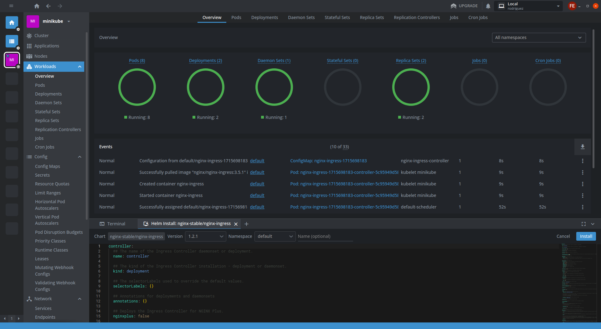
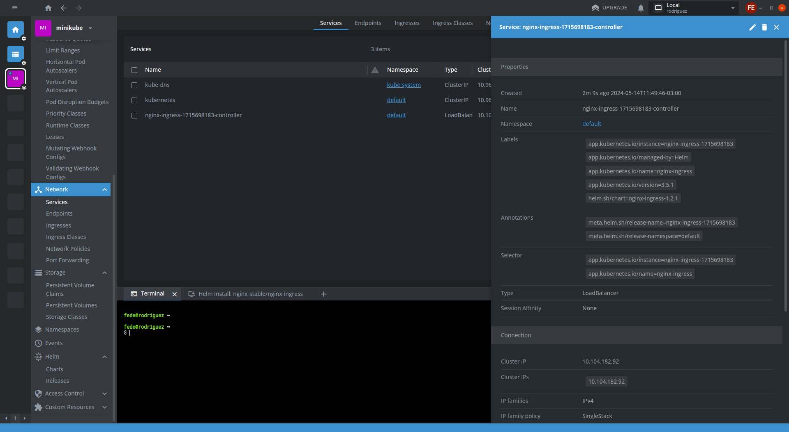

# Lens

Lens es un Entorno de Desarrollo Integrado (IDE) que permite a los usuarios conectar y gestionar múltiples clústeres de Kubernetes desde plataformas Mac, Windows y Linux. Para equipos y organizaciones, Lens ha demostrado ser la forma más efectiva de aprender Kubernetes, aumentar la productividad del equipo y reducir las herramientas necesarias para el desarrollo nativo de la nube.

La interfaz gráfica rica en funciones e intuitiva permite a los usuarios implementar y gestionar sus clústeres directamente desde la consola. Al mismo tiempo, los paneles de control integrados proporcionan métricas clave y conocimientos sobre todo lo que se ejecuta en el clúster, incluidas implementaciones, configuraciones, redes, almacenamiento, control de acceso e incluso recursos personalizados.

Aquí hay 3 diferenciadores clave que distinguen a Lens:

- Simplicidad: Como una aplicación independiente, Lens brinda a los usuarios la capacidad de gestionar todos los clústeres en cualquier plataforma simplemente cargando el archivo kubeconfig. Además, como una interfaz gráfica de usuario (GUI), Lens proporciona un enfoque de "apuntar y hacer clic" para la gestión de clústeres que elimina la complejidad de trabajar en una interfaz de línea de comandos (CLI).
- Accesibilidad: Lens permite a los usuarios crear un catálogo unificado de clústeres, servicios, cargas de trabajo, herramientas, automatizaciones y recursos relacionados para un fácil acceso y una vista unificada de la supervisión en tiempo real. El acceso único a eventos, registros y métricas permite a los usuarios solucionar errores y navegar fácilmente para encontrar la causa raíz antes de que se convierta en un problema.
- Personalización completa: Las Extensiones de Lens agregan funcionalidad y servicios personalizados para acelerar los flujos de trabajo de desarrollo tanto para tecnologías integradas con Kubernetes como para otras tecnologías nativas de la nube. Los usuarios pueden elegir entre cientos de Extensiones de Lens construidas por la comunidad y el ecosistema nativo de la nube, o incluso crear las suyas propias.

## Capturas

Kubernetes es una plataforma compleja con capacidades en constante expansión, lo que la convierte en una solución poderosa para las empresas que se dirigen hacia la contenerización. Con su amplio conjunto de características y su panel de control fácil de usar, Lens proporciona un medio eficaz para simplificar la gestión multicloud tanto para desarrolladores nuevos como experimentados.

Para las empresas que desean obtener los beneficios de Kubernetes sin lidiar con la complejidad, Lens es una opción que vale la pena considerar.