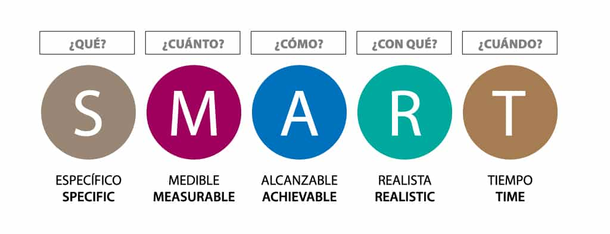

# Metodologia de Trabajo

En este apartado estaremos comentando algunas de las metodologias de trabajo que seran implementados durante el transcurso de la practica profesional. Este documento comenta todo tipo de tacticas que se implementan desde pequeños emprendimientos hasta en grandes empresas para mejorar la rapidez y la robustez del trabajo en cuestion.

## Manifiesto Agile

El Manifiesto Agile es una declaracion de valores y pricipios sobre nuevas formas de desarrollar software como reaccion a los tradicionales metodos formales con los que se trabajaba entonces en la industria.

El manifiesto propone descubrir nuevas formas de desarrollar software tanto por experiencia propia como ayudando a terceros basándose en los siguientes valores:

- **Individuos e interacciones** sobre procesos y herramientas: las personas son lo más importante, por encima de los procesos y las herramientas, por su capacidad para ser creativas e innovar. Los procesos y las herramientas deben servir de apoyo para que las personas cumplan sus objetivos.
- **Software funcionando** sobre documentación extensiva: las funcionalidades esperadas en software funcionando es más valioso que un documento muy detallado de requisitos, que además será muy difícil de crear antes del desarrollo de un proyecto por la inestabilidad de su naturaleza. Es más interesante el feedback temprano que pueden dar los usuarios al interactuar con un prototipo o con el producto parcial.
- **Colaboración con el cliente** sobre negociación contractual: el cliente es un miembro más del equipo. La colaboración continua con él genera más valor que el cumplimiento estricto de un contrato, que no hace más que crear barreras y delimitar responsabilidades.
- **Respuesta ante el cambio** sobre seguir un plan: Es más valiosa la capacidad de respuesta y adaptación a los cambios que la de seguir y asegurar el cumplimiento de los planes preestablecidos.

Los 12 principios que se rigen en base a los valores mencionados anteriormente establecen que la mayor prioridad es satisfacer al cliente a pesar de los requisitos que nos proporcione. Entregar software de forma frecuente en donde los proyectos se desarrollen en torno a individuos motivados donde la comunicacion entre ambas partes sea constante y de forma cara a cara para una mayor efectividad. La medidad principal de progreso es el software funcionando donde la atencion continua y el buen diseño mejora la agilidad. Los procesos agiles promueven el desarrollo sostenible capaz de mantener un ritmo constante y la simpleza debe reinar donde el equipo tiene que reflexionar de forma regular para poder perfeccionar el comportamiento en consecuencia.

### Scrum

Scrum es un marco de gestión de proyectos de metodología ágil que ayuda a los equipos a estructurar y gestionar el trabajo mediante un conjunto de valores, principios y prácticas. Al igual que un equipo de rugby (de donde proviene su nombre) cuando entrena para un gran partido, el método scrum anima a los equipos a aprender a través de las experiencias, a autoorganizarse mientras abordan un problema y a reflexionar sobre sus victorias y derrotas para mejorar continuamente.

Scrum presenta tres funciones: el propietario del producto, el experto en scrum y los miembros del equipo de desarrollo. Las tres funciones de scrum describen las responsabilidades clave de los miembros del equipo de scrum. No son cargos, lo que significa que cualquier cargo, incluso los que tienes en la actualidad, puede desempeñar una de las funciones. Como la esencia del scrum es el empirismo, la autoorganización y la mejora continua, las tres funciones dan una definición mínima de las responsabilidades y obligaciones para permitir a los equipos realizar el trabajo de manera eficaz; así se consigue que asuman la tarea de organizarse y seguir mejorando.

Scrum ofrece una estructura ligera con las tres funciones de scrum: miembro del equipo de desarrollo, propietario del producto y experto en scrum:

- Equipo de Desarrollo: El equipo de desarrollo es la gente que hace el trabajo. El equipo de desarrollo debe ser capaz de autoorganizarse para poder tomar decisiones con el fin de llevar a cabo el trabajo. 
- Propietario del Producto: Los propietarios de producto que utilizan scrum conocen los requisitos de los clientes y la empresa y, a partir de ahí, crean y gestionan el backlog del producto en función de ellos. Puesto que los equipos ágiles son, por naturaleza, flexibles y receptivos, es responsabilidad del propietario del producto asegurarse de que ofrezcan el máximo valor. La empresa está representada por esta persona, que le dice al desarrollador lo que prima entregar. La confianza entre estos dos roles es crucial.
- Experto en Scrum: El experto en scrum es la función que se encarga de unirlo todo y de garantizar que el scrum se haga bien. En términos prácticos, eso significa que ayuda al propietario del producto a definir el valor, al equipo de desarrollo a entregarlo y al equipo de scrum a mejorar. Es un líder servidor que no solo representa un estilo de liderazgo de apoyo, sino que describe lo que hacen en el día a día.

### Objetivos SMART

Los objetivos SMART son específicos, mensurables, alcanzables, relevantes y temporales. Son metas concretas que permiten analizar el desempeño de nuestros esfuerzos, ya sea en marketing o en cualquier área de una empresa que requiera ordenar y medir su trabajo de manera sistemática.



Aplicar los objetivos SMART en proyectos y negocios ayuda a avanzar con más seguridad y con mayor control sobre el proceso. Definir los objetivos SMART te ayudará a enfocar tus esfuerzos en tus metas de una manera inteligente. Por esta razón, se trata de una herramienta que contribuye a una mayor productividad y eficiencia y reduce el estrés laboral, al distribuir mejor los recursos y el tiempo.

## Flujos de Trabajo

En este apartado se comentaran algunos de los flujos de Trabajo mas utilizados y elegiremos uno de ellos el cual sera utilizado en esta practica.

### Flujo Git

Es uno de los mas conocidos en donde se trabaja con 2 ramas principales que tienen duracion infinita:

- master: esta rama contiene el código en produccion. Todo el código desarrollado sera colocado en esta rama en cierto momento.
- develop: Esta rama contiene el código en pre-produccion. Cuando las funcionalidades estan terminadas es cuando se colocan en produccion.

Las ventajas es que asegura un estado de limpio de las ramas en todo momento del ciclo del proyecto, como así tambien sigue un patron sistematico que hace mas facil el entendimiento. Las desventajas es que el historial se vuelve dificil de leer y no se recomienda cuando se necesita mantener una unica version en produccion.

### Flujo GitHub

Es considerada un flujo de trabajo liviano que cuenta con 6 principios principales:

- Cualquier cosa en la rama master es desplegable.
- Si se quiere trabajar con algo nuevo se crea una rama aparte y se le da un nombre descriptivo
- Se realizan commits de forma regular localmente como así tambien a la misma rama que se encuentra en el servidor.
- Cuando se necesita ayuda o feedback, o directamente la rama esta lista para ser enviada al master, se hace un pull-request.
- Cuando alguien mas revise y apruebe la funcionalidad, se coloca en el master.
- Una vez en el master, se debe desplegar de inmediato.

Es ideal para mantener una unica version en produccion y es amigable a las tecnicas de CD/CI. Pero el código en produccion puede pasar a ser inestable facilmente.

### Flujo GitLab

Combina el desarrollo centrado en las funcionalidades y las ramas de funcionalidades con rastreo de issues. La diferencia con GitHub es que no en todo momento se puede desplegar la aplicación a producción. Se basa en 11 reglas, pero estas son las mas importantes:

- Usa ramas de funcionalidades, osea no hay commits en el master.
- Se prueban todos los commits.
- Se corren todas las pruebas en todos los commits.
- Se revisa el código antes de colocarlo en el master.
- Los despliegues son automáticos
- Las etiquetas son puesta por el usuario.

Define el comportamiento CD/CI, provoca que el historial de Git sea mas limpio pero es mas complejo.

### Flujo Único

La condición principal es que en cada lanzamiento de produccion sea basado en el lanzamiento anterior. Ademas no contiene rama de desarrollo.

Las ventajas son que el historial es mas limpio y mas legible, flexible a decisión de equipo e ideal para la producción de una única versión. Pero no se recomienda para CD/CI.

## Estructura del Proyecto

La estructura de los proyecto es una de las primeras cosas a tener en cuenta debido a que hace al mismo proyecto reproducible.

### Consejos

- Los archivos del proyecto van en una sola carpeta
- Utilizar estructuras consistentes e informativas
- Para separar los archivos privados de los públicos se utiliza .gitignore o se lo coloca en una carpeta separada que no es git
- Se necesita un archivo [README.md](http://README.md) para describir el proyecto y las instrucciones para que el proyecto sea reproducible
- Organiza tus archivos en base a los componentes y no a los roles. Ademas, coloca los archivos de prueba al lado de los de implementación.

### Estructura Básica

Aquí se observa una estructura básica que puede representar un proyecto. Habitualmente la mayoria de los repositorios cuentan con esta estructura

- **Carpeta src:** Es la carpeta de código fuente. Sin embargo, en lenguajes que usan encabezados (o si tienes un marco de trabajo para tu aplicación) no coloques esos archivos aquí.
- **Carpeta test**: Pruebas unitarias, pruebas de integración.
- **Carpeta .config**: Debe contener la configuración local relacionada con la configuración en la máquina local.
- **Carpeta .build**: Esta carpeta debe contener todos los scripts relacionados con el proceso de construcción (PowerShell, Docker compose…).
- **Carpeta dep**: Este es el directorio donde se deben almacenar todas tus dependencias.
- **Carpeta doc**: La carpeta de documentación
- **Carpeta res**: Para todos los recursos estáticos en tu proyecto. Por ejemplo, imágenes.
- **Carpeta samples**: Proporciona ejemplos
- **Carpeta tools**: Directorio de conveniencia para tu uso. Debe contener scripts para automatizar tareas en el proyecto, por ejemplo, scripts de construcción, scripts de cambio de nombre. Generalmente contiene archivos .sh, .cmd por ejemplo.

### Estructura Actual

```
pps_fede_Ferro_2024/
├── docs/                 # Documentacion del Proyecto
├── src/                  # Contiene todo el código del Proyecto
├── README.md             # Previsualización del Proyecto
```

## Commits

La forma en que aplicaremos los commits están reglamentados en la especificación Conventional Commits que nos provee una serie de reglas sencillas para poder crear un historial explicito de commits, donde sea mas fácil escribir herramientas automatizadas encima de eso. La estructura esta basada en la siguiente forma: 

```
<tipo>(enfoque opcional): <descripcion>
```

Los tipos mas utilizados y que se emplearan en este trabajo son:

- **feat**: representa una nueva funcionalidad o un cambio significativo.
- **fix**: representa correcciones pequeñas o arreglos insignificantes.

El enfoque consiste en un sustantivo que describe la seccion que representa el commit.

Y por ultimo una pequeña descripcion que resume los cambios realizados en el repositorio.

Posteriormente se puede usar otras características que nos ayudan a distinguir de una mejor manera los commits, pero lo mencionado anteriormente regula lo basico y representara lo que se va a utilizar en la actual practica.

## README

Los archivos README contiene la *informacion importante que el usuario tiene que leer antes de proceder*. Suele ser la primera y unica observacion en el proyecto que tiene el usuario, entonces es importante explicar lo que hace el proyecto y como lo hace de manera efectiva. el README tiene que decir:

- Que es? (con contexto previo)
- Mostrar como funciona
- Mostrar como se usa
- Expresar otros detalles relevantes

### Elementos claves

- nombre: Buscar nombres que se expliquen por si mismos.
- breve descripcion: Una breve descripcion de una linea describiendo el proyecto ayuda a tener una idea de que hace el mismo.
- uso: Siempre es mejor mostrar el proyecto en una aplicacion real o ejemplo.
- elementos visuales: incluir screenshots o videos
- instalacion: proveerle y explicarle al usuario todo lo que necesita saber.
- licencia: aplicarla y mostrarla lo mas arriba posible.
- roadmap: explicar las ideas a futuro del proyecto.

### Recomendaciones

- Poner links de referencia donde sea posible para mayor entendimiento del proyecto.
- Poner el código de ejemplo en el repositorio.
- Estado del Proyecto