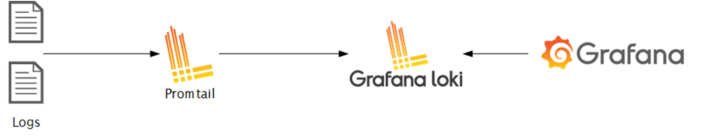
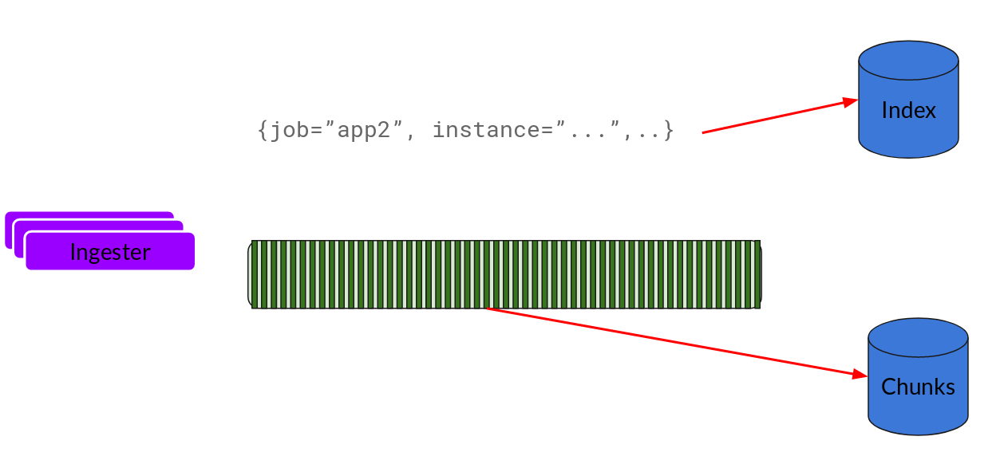
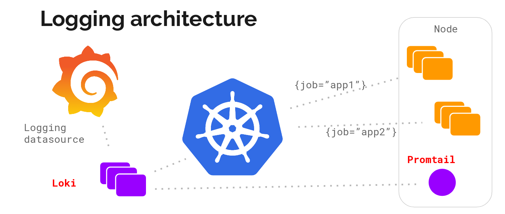
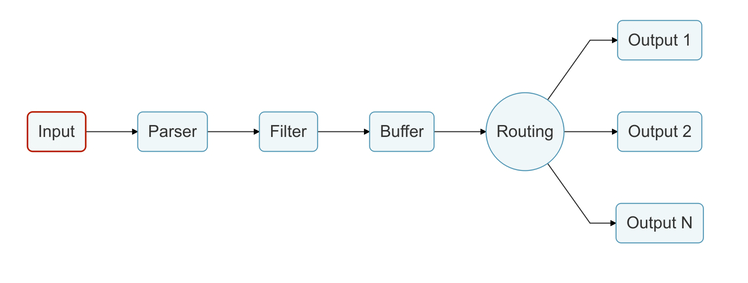

# Monitoreo

## PLG Stack

No te sorprendas si no encuentras este acrónimo, es más conocido como Grafana Loki. De todos modos, este conjunto de herramientas está ganando popularidad debido a sus decisiones de diseño concretas. Quizás conozcas Grafana, que es una herramienta de visualización popular. Grafana Labs diseñó Loki, que es un sistema de agregación de registros horizontalmente escalable, altamente disponible y multiinquilino inspirado en Prometheus. Solo indexa metadatos y no el contenido del registro. Esta decisión de diseño lo hace muy rentable y fácil de operar.

**Promtail** es un agente que manda los logs del sistema local al cluster de Loki.

**Grafana** es la herramienta de visualización que consume la información proveniente de Loki.

**Loki** se construye sobre los mismos principios de diseño que Prometheus, por lo tanto, es una buena opción para almacenar y analizar los registros de Kubernetes.



### Componentes

- Promtail: Este es el agente que se instala en los nodos (como Daemonset); extrae los registros de los trabajos y se comunica con el servidor de API de Kubernetes para obtener los metadatos y utilizar esta información para etiquetar los registros. Luego, reenvía el registro al servicio central de Loki. Los agentes admiten las mismas reglas de etiquetado que Prometheus para asegurarse de que los metadatos coincidan.
- Distribuidor: Promtail envía registros al distribuidor, que actúa como un búfer. Para manejar millones de escrituras, agrupa el flujo de entrada y lo comprime en bloques a medida que llegan. Hay múltiples ingesters, los registros pertenecientes a cada flujo terminarían en el mismo ingester para todas las entradas relevantes en el mismo bloque. Esto se hace utilizando el anillo de ingesters y el hashing consistente. Para proporcionar resiliencia y redundancia, lo hace n veces (predeterminado 3).
- Ingester: A medida que llegan los bloques, se comprimen con gzip y se agregan registros. Una vez que el bloque se llena, se vuelca en la base de datos. Los metadatos van a Index y los datos de registro del bloque van a Chunks (generalmente en un almacenamiento de objetos). Después del volcado, el ingester crea un nuevo bloque y agrega nuevas entradas en él.

Algunos de los terminos basicos utilizados son:

- Index: El índice es una base de datos como DynamoDB, Cassandra, Google Bigtable, etc.
- Chunks: El bloque de registros en formato comprimido se almacena en los almacenes de objetos como S3.
- Querier: Esto está en la ruta de lectura y realiza todo el trabajo pesado. Dado el rango de tiempo y el selector de etiquetas, busca en el índice para averiguar cuáles son los bloques coincidentes. Luego, lee esos bloques y realiza una búsqueda para obtener el resultado.

Una vez que el chunk "se llena", lo volcamos en la base de datos.



### Arquitectura



## FluentBit

Fluent Bit es una navaja suiza de código abierto y multiplataforma para procesamiento y distribución de registros. En la actualidad, los datos provienen de diversas fuentes y Fluent Bit está aquí para ayudarte a agregar y procesar todos tus datos de manera confiable, segura y flexible.

Fluent Bit se basa en algunos conceptos fundamentales que son muy importantes para entender cómo funciona.

### Conceptos Claves

- Evento o Registro: términos intercambiables que se refieren a cada pieza de datos que es recuperada por Fluent Bit.
- Etiqueta: Una Etiqueta se especifica manualmente (en la mayoría de los casos) en la configuración del Plugin de Entrada y es utilizada por el Enrutador para identificar información y determinar a través de qué Filtro o Salida debe pasar la información.
- Coincidencia: Cuando hablamos de Etiquetas, dijimos que una Etiqueta es utilizada por el Enrutador para identificar información y decidir dónde enviarla. Una Coincidencia es cómo el enrutador sabe quién debe recibir la información. Los Enrutadores entregan la información a quien tenga una Coincidencia que coincida con la propiedad de configuración especificada Etiqueta en el plugin de entrada. Coincidencia es una propiedad de configuración presente en la configuración de Filtros y Plugins de Salida.
- Mensajes Estructurados: Ya sean estructurados o no, cada Evento que es manejado por Fluent Bit se convierte en un mensaje estructurado, mediante el formato de datos MessagePack. Los mensajes estructurados ayudan a Fluent Bit a implementar operaciones más rápidas.

### Pipeline

Ahora que conocemos los conceptos clave de Fluent Bit y el mecanismo de almacenamiento en búfer, debes estar preguntándote "pero ¿cómo funciona todo internamente?"

Trabajando como un agregador y reenviador de registros, Fluent Bit tiene su propia forma de recuperar, organizar, modificar y reenviar toda la información que maneja.

Este proceso se llama Tubería de Datos, que es un camino por el cual toda la información recuperada por los Plugins de Entrada de Fluent Bit debe pasar.

Nos referiremos a cada parte de esta tubería como etapas.



## Instalación

Aquí tienes una versión mejorada:

---

Para instalar la estructura de monitoreo de logs, simplemente descarga el script `loki-setup.sh` ubicado en la carpeta `/src/dev` de nuestro repositorio en GitHub. Asegúrate de otorgarle los permisos de ejecución adecuados antes de proceder con la instalación.

```bash
sudo chmod +x loki-setup.sh
./loki-setup.sh
```

Una vez completada la instalación, puedes acceder a Grafana de forma local mediante el siguiente comando:

```bash
kubectl port-forward --namespace loki service/loki-grafana 3000:80
```

Después de ejecutar este comando, podrás ingresar a Grafana a través de tu navegador web favorito, utilizando la dirección http://localhost:3000. Utiliza las credenciales de inicio de sesión proporcionadas anteriormente, con el usuario **admin** y la contraseña que obtuviste durante el proceso de instalación.

## Referencias

https://www.infracloud.io/blogs/logging-in-kubernetes-efk-vs-plg-stack/

https://codersociety.com/blog/articles/loki-kubernetes-logging

https://faun.pub/fluent-bit-a-brief-introduction-3a9044312fe3

https://artifacthub.io/packages/helm/grafana/loki-stack